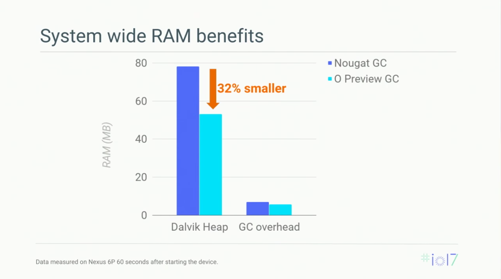
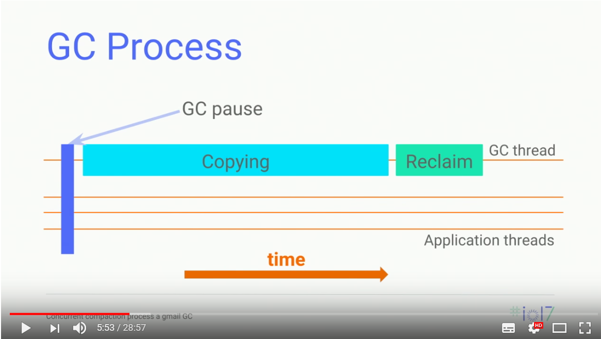
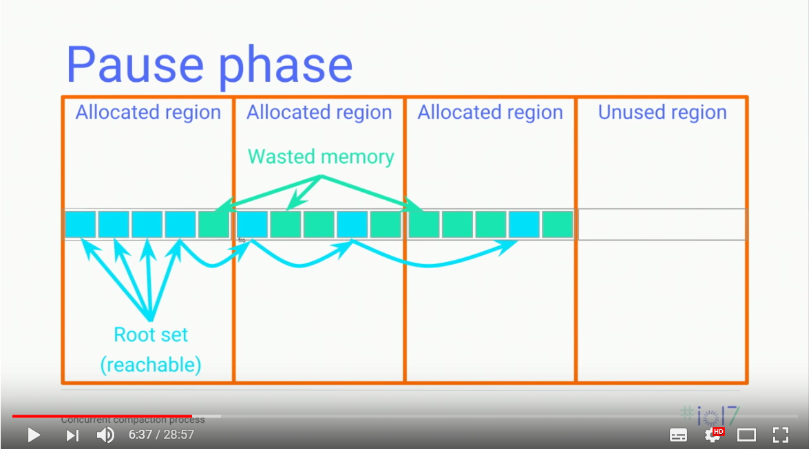
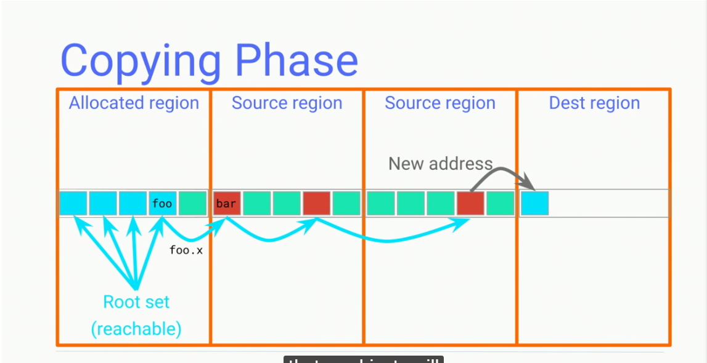
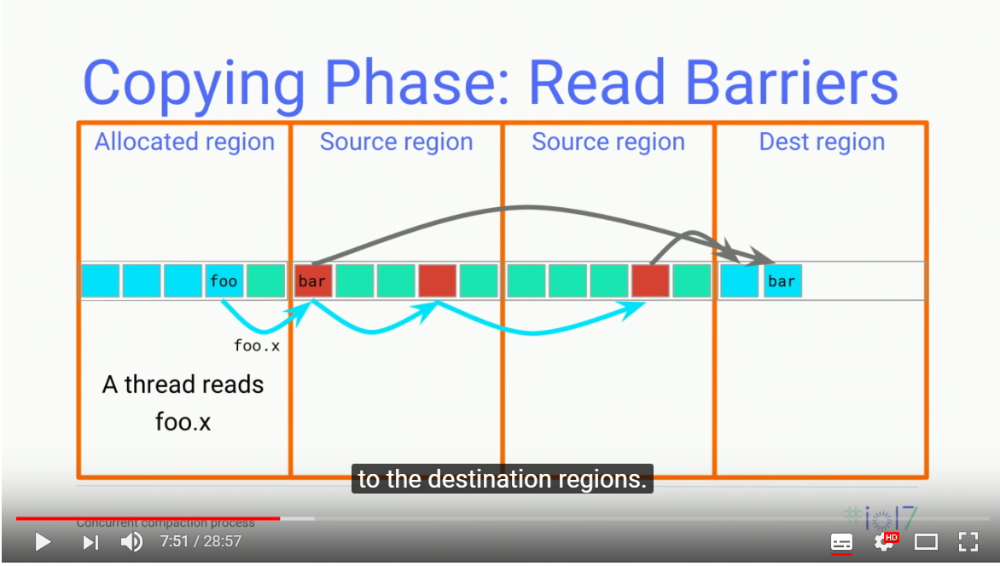
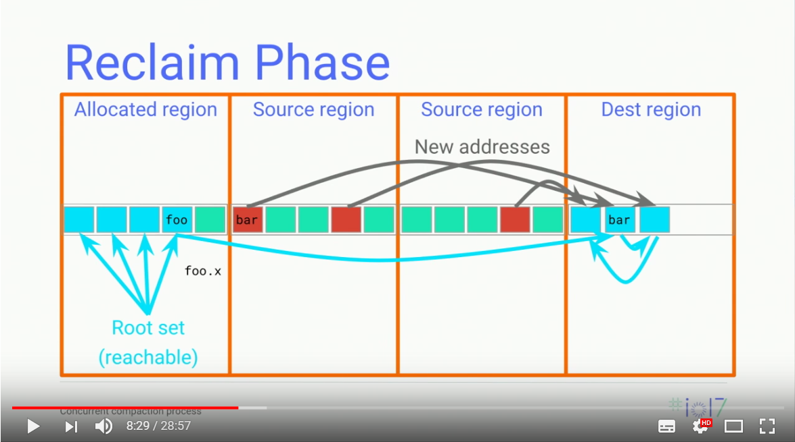
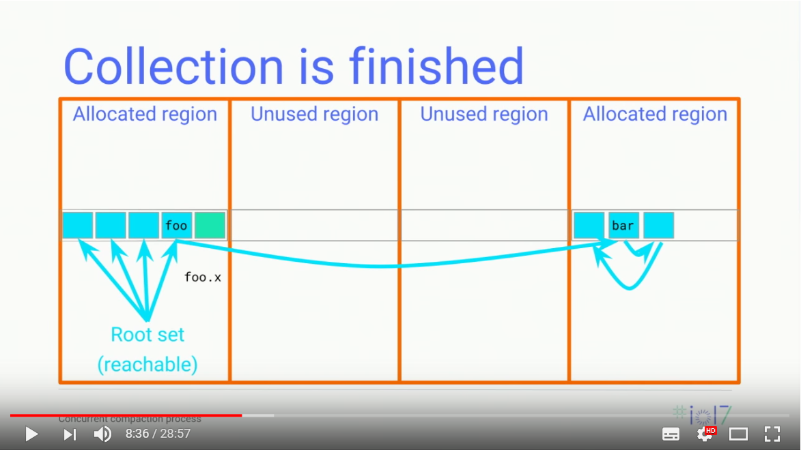
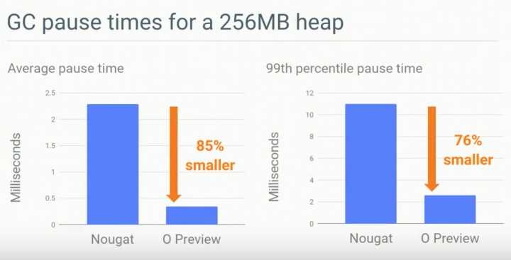
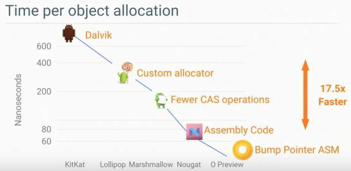

搜索了近几年有关GC的论文，没看到什么有很大突破的，引用量没有上百的。基本上都是在特定的场合下优化改进传统GC算法的一些细节。

Performance and Memory Improvements in Android Run Time (ART) (Google I/O '17)
https://www.youtube.com/watch?v=iFE2Utbv1Oo
下面看一下最新发布的Android O上使用的GC。安卓8的GC比安卓7的GC有了非常明显的提升。而且最主要的，从非concurrent变成了concurrent。（如果我没听错的话。）可以看到，GC的主题算法仍然属于之前的几个主要算法，只是在很多细节做了对应的修改。Android N 使用了 mark-sweep，而Android O使用了concurrent的压缩复制算法。  
效果：  
 

整个压缩-复制GC处理过程分为三步，GC Pause，确定要被GC的区域；copying Phase, 进行压缩复制；reclaim phase，释放无用空间。
 

1. Pause phase  
这个阶段不是concurrent的，所有的线程要被挂起。但是这个阶段费事很短暂。这里很重要的一块儿工作是确定需要进行GC的region。当前进程中所有正被使用的那些region中存在高度碎片的region会被选中，而这些被选中的region被称为source region。在GC完成后这些被选中的source region就可以被释放了。从图中可以看出本次GC选中了中间的两个碎片比率很大的region作为source region。在Pause阶段完成对所有线程stack的walk并得到最终的root set之后，就可以唤醒所有的线程并进入到GC的下一个Copying阶段。
 
2. Copying Phase
Copying阶段是整个GC中耗时最长的阶段。通过将source region中根据root set计算并标记为reachable的对象拷贝到destination region，并且确保在GC完成后没有任何指向source region中内存的引用，然后修改所有指向source region的活对象使他们指向新的destination region中的新地址。由于现在应用程序线程正在同GC线程一同运行，GC需要确保其它线程不会读到依旧指向source region的对象，而新的GC则使用了read barrier技术来达到这个目的。
 
这个时候，和其他的线程是concurrent的，所以会遇到进程的其他线程访问这些source region的情况。所以，Android O使用了Read Barrier的方法
 
所谓read barrier是一小段代码，并且被运行期环境(runtime)安插在field read前来防止其它线程看到指向source region的引用。如果其它线程在Copying阶段需要访问曾经存在于source region中的对象，GC的read barrier逻辑会负责截获这个读取并且将数据拷贝到destination region然后返回这个被拷贝到destination region的新引用。当所有的source region的所有reachable对象都被转移到destination region之后就可以进入到GC的下一个Reclaim阶段了
 
3. Reclaim Phase
在经过Copying阶段后，整个进程中就不再存在指向source regions的引用了，GC就可以将这些source region的内存释放供以后使用了。
 
GC结果：
 
而平均GC Latency也得到了大大的降低，具体对比见图

 另外由于heap总是经过compact的，从而可以实现Thread Local Bump Pointer的简单内存分配器，因为现在分配内存不再需要复杂的free list管理只需要一个简单的pointer bump，内存分配的速度也得到了显著的提升。
 