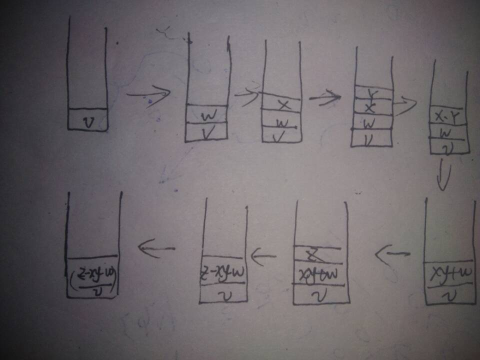
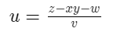

# ICS_HM06_solutions

## PB16030899_朱河勤       &emsp;2017/12/15
---
    
## 1. 
* 256 .
because the trap vector has 8 bits
* because the two routinues may  be in different pages, the 9-bits pcoffset can't express the address.  
* 3 . 
  * Firstly, save pc and psr in Saved.ssr. 
  * Next, get the content of the trap vector(extended).
  * Then jump to the instructions where the subroutinue locates. 


## 2.
First in, last out.

## 3. 
 * push push pop push pop push push pop push pop pop pop push push push pop pop pop
 * It's the catalan num 
  let n be 4, so the result is 14


## 4.
```asm
	;R6 IS THE STACK POINTER 
	;THE DATA IS STORED IN R1,R0, TO FORM A NUM
	;R5 STORES THE INFO THAT INDICATES SUCCESS(0) OR FAILURE(1)
POP	ST R2,SAVER2
	LD R2,BASE
	ADD R2,R2,R6
	ADD R2,R2,#2
	BRz	FAIL
	LDR R0,R6,#0
	ADD R6,R6,#1
	LDR R1,R6,#0
	ADD R6,R6,#1
	BRnzp EXIT

PUSH	ST R2,SAVER2
	ST R3,SAVER3
	LD R2,BASE
	ADD R2,R6,R2
	ADD R2,R2,#-2
	LD R3,MAX
	ADD R2,R2,R3
	BRn	FAIL
	STR R1,R6,#0
	ADD R6,R6,#-1
	STR R0,R6,#0
	ADD R6,R6,#-1
	LD R3,SAVER3

EXIT	LD R2,SAVER2
	AND R5,R5,#0
	RET
FAIL	LD R2, SAVER2
	AND R5, R5,#0
	ADD R5,R5,#1
	RET


SAVER3	.BLKW	1
SACER2	.BLKW	1
BASE	.FILL	XB000  ; -X4000
MAX	.FILL	X20

```
## 5.
output `EE some`
## 6.
 R7 stores the pc of the caller's next instruction. In the subroutine, Store the value of  R7 wherever R7 is uesd (such as trap routinue)

 the modified routine is as blow 

```asm
        .ORIG x020F
START   LDR R1, R0, #0
        BRz DONE
        ST R0, SAVER0
        ADD R0, R1, #0
        ST R7,SAVER7
        TRAP x21
        LD R7,SAVER7
        LD R0, SAVER0
A       ADD R0, R0, #1
        BRnzp START
DONE    RET

SAVER7 .BLKW 1
SAVER0 .BLKW #1
        .END
```
## 7.
* a



* b

```
PUSH A
PUSH C
ADD
PUSH B
PUSH C
SUB
PUSH A
MUL
PUSH D
ADD
POP E
```