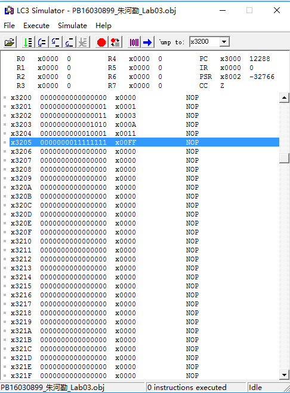
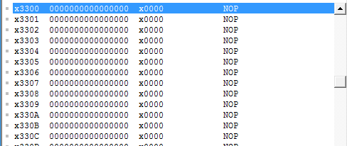
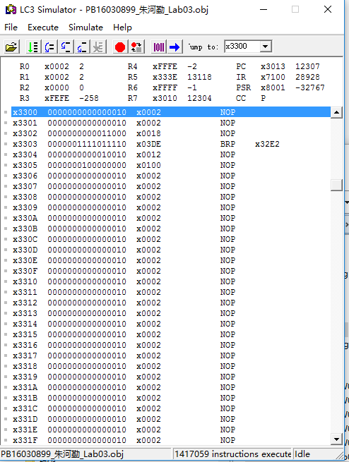

# Lab02       
## PB16030899 Zhu Heqin

<!-- TOC -->

- [Lab02](#lab02)
    - [PB16030899 Zhu Heqin](#pb16030899-zhu-heqin)
    - [PURPOSE](#purpose)
    - [PRINCEPLE](#princeple)
    - [PROCEDURE](#procedure)
    - [RESULT](#result)

<!-- /TOC -->
## PURPOSE
This lab let us use `ASSEMBLE` language to write programs. Through this experience, I can have a deep understanding of the ISA and use assemble language more proficiently.

Assemble language is interesting and more brief,friendly  than machine language. I am willing to use assemble language to build programs.

## PRINCEPLE
Iinstructions I used are as follows
* LD
* LDR
* STR
* ADD
* AND
* BR
* JSR
* RET

and **`persudo-op`**
.FILL

Some key points in this lab and solutions
|**key points**|**solution**|
|:------------:|:----------:|
|control structure|if  else if else|
|mul|add|
|compare|add,BR|

Since there has no instrucitons  for multiplication,SO I write a subroutine to calculate it. To achieve this ,I use addition. For example, to calculate a*b, you can add a for b times or add b for aa times.
## PROCEDURE
Firstly, I learned the asemble language for some time. Then I quickly write the program . Three has been some problems when debugging.

Iuse R0 to store the result of R0*R1 , and I add R0 for R1 times. It's wrong ,since R0 has a value, I should add it for (`R1-1`) times.

Another problem is the branch condition , it must be precise and  correct.

One annoying point is that the LC-editor doesn't display the line number , so it's troublesome to locate the line which has errors.

Also, the `o` and `0` are too similar inshape. You caneasily recognize one of them as another.

## RESULT
Before executing the program: 

After executing the program: 

It works well. Through this lab , I learned a lot.  Assemble language is so brief and useful.