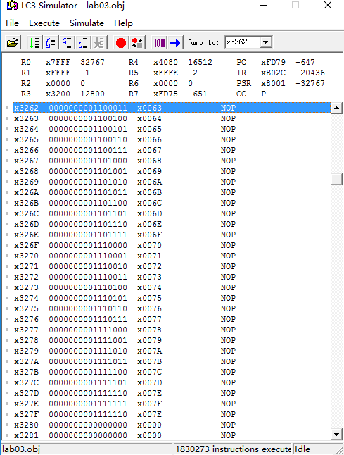
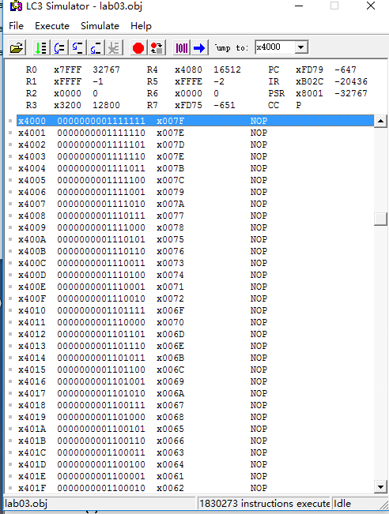

# Lab03 &emsp; 2017/11/13
## PB16030899 Zhu Heqin

<!-- TOC -->

- [Lab03 &emsp; 2017/11/13](#lab03-emsp-20171113)
    - [PB16030899 Zhu Heqin](#pb16030899-zhu-heqin)
    - [PURPOSE](#purpose)
    - [PRINCEPLE](#princeple)
    - [PROCEDURE](#procedure)
    - [RESULT](#result)
    - [ATTACHMENT](#attachment)

<!-- /TOC -->
---
## PURPOSE
This lab let us use `ASSEMBLE` language to write a program that  can sort the data stored in two locations. To some degree ,it's a bit hard . Through this lab, so  fluently of coding and deep understanding of the assemble language that I've gained. 

Also, I feel a sense of achievement aftering the correct result appeared . THough it took me about two hour to accompilish this lab.

---

## PRINCEPLE
Iinstructions I used are as follows
* LD
* LD
* LDR
* STR
* ADD
* NOT
* AND
* BR
* JSR
* RET

and **`persudo-op`**
* .FILL
* .ORIG
* .END


There are some beautiful subroutines I wrote to cooperate the progranm to solve the problem.

* `CMP`:CMP MEM[R0],MEM[R1], SAVE RST IN R6
* `EQBGN`:CMP IF THE CONTENT OF R0 IF THE SRCEND,AND STORE THE RST IN R6
* `WRITE`:WRITE MEM[R1] TO MEM[R4]  ,TWO LOCATION,AND MOVE THE HIGNEST SRC DATA (R5) TO THE POSITION OF MAX (R1)

---

## PROCEDURE
Firstly ,I write a small programm to set the test case so that I won't waste too much time to set data mannually.

Then I wrote the programm with some subroutines concentrately .

I learned the asemble language for some time. Then I quickly write the program . Three has been some problems when debugging.

I got some experience:
* Behind the persudo-op `.ORIG` ,threr must be a memory address
* Whatever the instruction is. it will be invalid when it 's after  the persudo-op `.END`  
* make full use of  `.STRINGZ`

---

## RESULT
Before executing the program:





After executing the program: 





It works well. Through this lab , I learned a lot.  Assemble language is so brief and useful.

## ATTACHMENT
This is the small program to set the test data.
```asm
	.ORIG X3000
	LD R5,NUM
	LD R3,SRCBGN
	LD R1,NUM

TESTVAL ADD R0,R5,R3
	ADD R1,R1,#-1
	STR R1,R0,#0
	ADD R5,R5,#-1
	BRp TESTVAL


NUM	.FILL #127
SRCBGN	.FILL x3200

	HALT
	.END
```