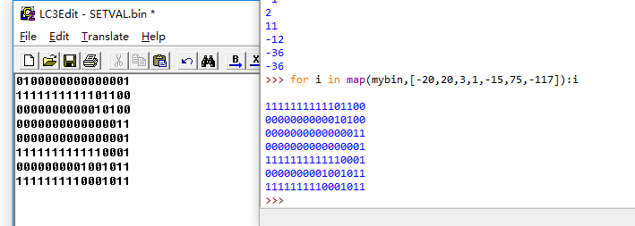
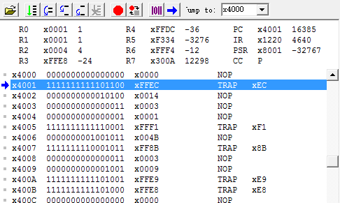
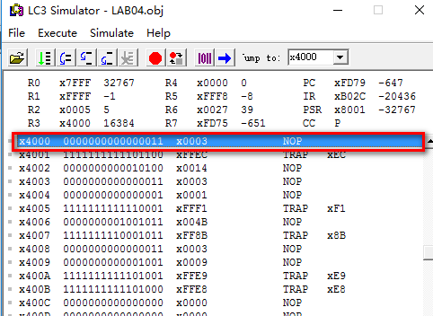
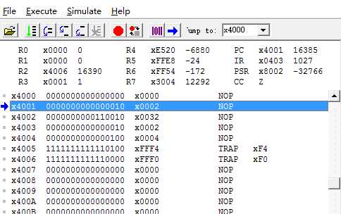
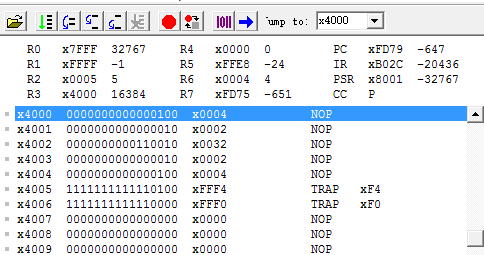

# Lab04 &emsp; 2017/12/2
## PB16030899 Zhu Heqin
<!-- TOC -->

- [Lab04 &emsp; 2017/12/2](#lab04-emsp-2017122)
    - [PB16030899 Zhu Heqin](#pb16030899-zhu-heqin)
    - [PURPOSE](#purpose)
    - [PRINCEPLE](#princeple)
    - [PROCEDURE](#procedure)
    - [RESULT](#result)
        - [test case 1:    $f(x)=x^3-15x^2+75x-117$](#test-case-1----fxx^3-15x^275x-117)
        - [test case 2:    $f(x)=4x^2-12x-16$](#test-case-2----fx4x^2-12x-16)
    - [ATTACHMENT](#attachment)

<!-- /TOC -->

---
## PURPOSE
This lab is more difficult than the three formmer ones. It's a bit hard . Through this lab, we should get grape of the concept of subroutines and write more powerful programms that contains algorithm such as the `two-div find` , which is the represent of the thinking of <mark>divide and conquer</mark>. 
By this way, we can get the root of a polynomial .

---

## PRINCEPLE
Iinstructions I used are as follows
* LD
* LDI
* LDR
* ST
* STR
* ADD
* NOT
* AND
* BR
* JSR
* RET

and **`persudo-op`**
* .FILL
* .ORIG
* .END


I wrote two subroutines :

* `twodiv`:it takes two ends of an interval (stored in R1,R2) , and return the mid of them ,stored in  R0 
* `func`: it cal the fun with val stored in R0 , and stored the result in R4.
in the function , I also write mul label to multiply  two num

---

## PROCEDURE

I get some bugs when dubugging:
1. in the function , the first step is to store the registers that will be used in the subrourine.
2. then clear the val of the registers
3. make sure the two ends of the interval changes correctly, that is , the left increase, and the right decrease.
4. in the subroutine, if you want to jump to another subroutine, save the val of  R7, which contains the origin return-addr , otherwise it will be covered and the subroutine can't return the main routine.

When dubugging , to quickly set the test case, I write the val in binary and load it in the simulator.
What's more ? to get a num's two's implement code , I use python scipt to generate it。 The script is attchted at the end of the file. 
It looks like this


---

## RESULT

###test case 1:    $f(x)=x^3-15x^2+75x-117$

Before executing the program:


After executing the program: 


###test case 2:    $f(x)=4x^2-12x-16$

Before executing the program:


After executing the program: 





It works well. Through this lab , I learned a lot.  Assemble language is so brief and useful.

## ATTACHMENT
This is the small `python` script to get  **two's implement code** of a num. So I can load this obj to the simulator to set the test case value.
```python
def mybin(n,length=16):
    rst=0
    if n<0:
        n=-n
        if not n&(n-1):  # judge if n is 2^k
            ct=0
            while n!=1:
                ct+=1
                n=n>>1
            rst= '1'*(length-ct)+'0'*ct
        else:
            s=bin(n-1)[2:]
            sn=''.join(['1' if i=='0' else '0' for i in s ])
            rst='1'*(length-len(s))+sn
    else:
        s=bin(n)[2:]
        rst = '0'*(length-len(s))+s
    print(rst)
```