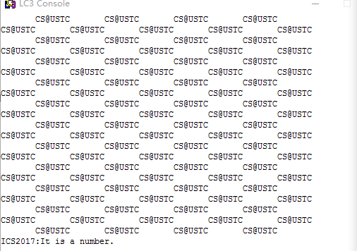
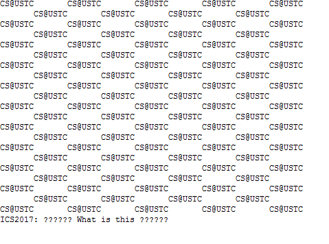

# Lab05 &emsp; 2017/12/21

## PB16030899 Zhu Heqin

---
## PURPOSE
This lab is aimed at improving our understanding of the principle of interrupt-driven io and the usage of stack and intterrupt vector.

To some degree, it's important and different to get gripe of the principle and write the programm buglessly.

---

## PRINCEPLE

### <mark>stack</mark>
It is a kind of data structure that allow it's elements `last in, first out`. Because of this characteritics, it is widely used in many situations.
In this lab, it is used to store the origin programm's info such as the PSR and PC in superuser stack.

### <mark>interrupt-driven io</mark>
It's more efficient than polling, because it needn't to examine the KBSR every instruction cycle.
The cpu just execute the instructions until the interrupt occurs. After compare the priority of tasks, it deals with the io. After that, the cpu will continue to execute the origin programm, seeming nothing happened.

### <mark>interrupt service subroutine</mark>
It is a subroutine that handle the interrupt situation. It is somewhat identitical to the trap routinues and trap vectors.
In this lab, we should write a subroutine to judge if the keyboard input is a number.

---
## PROCEDURE

1. Firstly, I learnd related rules. It's the key step of this lab :)
2. THen I write the interrupt service routine. THough we can't use the trap vector to output a string, it is just a piece of cake .

3. As for the user_programm, I set the stack point namely R6 as val x3000, 
then    I set the IE bit of the KBSR as 1 by using `MASK x4000`. Then I use the instruction `STI R0, INKB` to set the interrupt entry `x0180 : x1500`
4. Last, I write a endless loop for outputing the str
`CS@USTC              CS@USTC              CS@USTC              CS@USTC              CS@USTC               CS@USTC`
5. `NOTICE`: Because of the high speed of outputing, It is hard to see the output of the interrupt service routine. When I running this programm, I set a breakpoint at the last instruction of the interrupt sercice routinue, which location is x151e.

---

## RESULT
### input a num

### input a non-number

## SUMMARY
Through this lab, I have a deep understanding the stack and interrupt-driven io. I am exemely happy to learn such knowledge which is useful and intersting.

Thanks for the studying guide of Mrs An and teaching assistants.

<mark><bold><i>Merry Christmas</i></bold></mark>